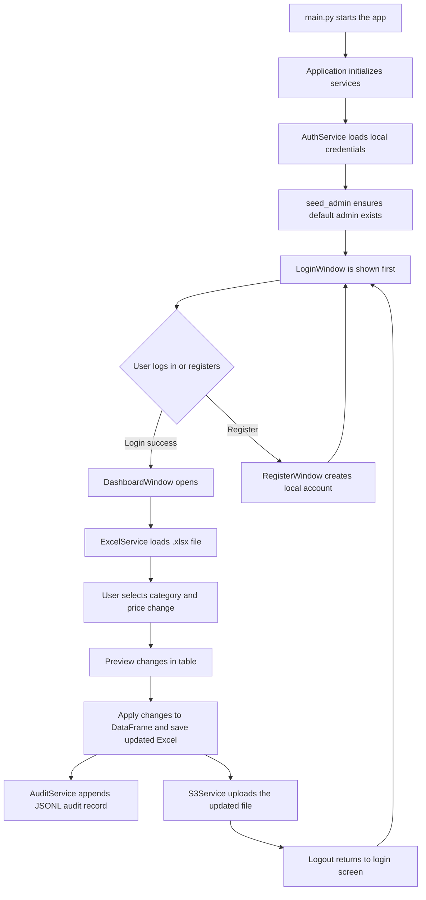

# Pizza Pricing Tool Application Flow

This document explains how the application runs from startup to logout, and what each source file does in that flow. It also reflects the current runtime behavior where audit events are written to a JSONL file instead of SQLite.

I am focusing on the source files that actually participate in the application. Generated folders such as build and dist are omitted because they do not control runtime behavior.

## End-to-End Flow

## What Each File Does

### 1) `main.py`

This is the application entry point. It creates the top-level CustomTkinter window, initializes runtime services, seeds the default admin user, creates the login and register views, and switches between views.

Key responsibilities:

- Imports the UI frames and the backend services they depend on.
- Sets the global appearance theme for CustomTkinter.
- Creates `AuthService` and calls `seed_admin()` so the app always has a working default account.
- Creates the login and register windows once, then swaps them in and out of the grid.
- Creates the dashboard only after a successful login.
- Clears the login or registration fields when switching screens so stale values do not remain visible.

Important runtime behavior:

- The app starts in the login screen.
- Login success moves the user to the dashboard.
- Logout destroys the dashboard and returns the user to login.
- Register screen is used to create new local accounts in the JSON credentials file.

Important design detail:

- The dashboard is created on demand each time the user logs in. That helps refresh the internal state and prevents the old dashboard instance from lingering after logout.

### 2) `ui/login_window.py`

This file defines the login screen.

Key responsibilities:

- Draws the username and password fields.
- Handles basic validation for empty input.
- Calls `AuthService.login()` to verify credentials.
- Calls back to the main app when login succeeds.
- Provides a button to go to the register screen.

How it fits into the flow:

- `main.py` passes two callback functions into this window:
  - one for successful login
  - one for moving to registration
- `handle_login()` reads the input fields, validates them, and then asks `AuthService` to authenticate the user.
- If authentication succeeds, the app switches to the dashboard.
- If authentication fails, a message box shows an error.

Behavior notes:

- Input is stripped before validation, so accidental spaces do not break login.
- Password input is masked with `show="*"`.
- The sign-in button is bound directly to `handle_login()`.

### 3) `ui/register_window.py`

This file defines the registration screen.

Key responsibilities:

- Draws fields for username, password, and confirm password.
- Validates that all fields are filled in.
- Validates that both password values match.
- Calls `AuthService.create_account()` to persist the new user.
- Returns to the login screen after a successful registration.

How it fits into the flow:

- The main app passes callback functions so the register screen can return to login after success or when the user clicks back.
- When registration succeeds, the new username and hashed password are written to the local credentials file.

Behavior notes:

- Password confirmation happens before any save attempt.
- This screen does not log the user in automatically after registration; it returns to login instead.
- Like the login screen, the input fields are cleared later by `main.py` when navigation happens.

### 4) `ui/dashboard_window.py`

This is the main working screen after login. It is the largest UI file because it coordinates file loading, previewing, applying changes, auditing, and S3 upload.

Key responsibilities:

- Welcomes the current user and provides a logout button.
- Lets the user browse for an Excel file.
- Loads category names from the spreadsheet.
- Accepts a price change value.
- Shows a preview table before changes are committed.
- Applies the price update to the selected category.
- Saves the modified file to the updated_excels folder.
- Appends an audit record to a file-based JSONL log.
- Uploads the updated file to S3 or a presigned URL target.
- Shows progress indicators while work happens in background threads.

How it fits into the flow:

- After login, `main.py` creates this frame and passes the auth service plus a logout callback.
- The dashboard creates its own `ExcelService`, `AuditService`, and `S3Service` instances.
- Browsing for a file starts a worker thread so the GUI does not freeze while Pandas loads the spreadsheet.
- Preview generation uses the loaded DataFrame but does not yet modify the file.
- Applying changes starts another worker thread, writes a new Excel file, appends an audit entry, and enables upload.
- Uploading also runs in a worker thread.

Important control flow details:

- `browse_file()` opens a file picker limited to .xlsx files.
- `_threaded_load_file()` calls `ExcelService.load_file()` in the background.
- `_process_file_load_complete()` updates the UI on the main thread using `after(0, ...)`.
- `generate_preview()` checks that a category is selected and that the price change is numeric.
- `apply_changes()` asks for confirmation before modifying data.
- `_threaded_apply_changes()` calls `ExcelService.apply_and_save()` in the background.
- `_process_apply_changes_complete()` calls `AuditService.log_change()` to record the event in the JSONL file.
- `upload_to_s3()` uses the currently saved updated file only.
- `_threaded_upload()` delegates the actual network call to `S3Service`.
- `handle_logout()` clears the authenticated session and returns to the login view.
- `refresh()` rebuilds the service objects so any config changes are picked up.

UI behavior notes:

- The progress bar is simulated and animated in steps while the real work happens in threads.
- The app uses `ttk.Treeview` for the preview table inside a CustomTkinter frame.
- The code styles the tree view manually to match the current light or dark appearance mode.
- The preview table is cleared whenever a new file is loaded or changes are applied.

### 5) `services/excel_service.py`

This file contains the core spreadsheet business logic.

Key responsibilities:

- Loads the Excel spreadsheet into a Pandas DataFrame.
- Normalizes column names so downstream code can rely on lower-case underscore names.
- Returns the list of pizza categories found in the data.
- Calculates a preview of the new prices without saving anything.
- Applies the actual price change to the DataFrame.
- Recalculates total_price when quantity exists.
- Saves the modified file into the updated_excels folder.

How it fits into the flow:

- `DashboardWindow` uses this class for all spreadsheet operations.
- `load_file()` must succeed before category lookup, preview, or save can work.
- `get_categories()` populates the category dropdown.
- `preview_changes()` builds the table rows shown in the dashboard.
- `apply_and_save()` performs the real mutation and file export.

Important data assumptions:

- The file must be an .xlsx file.
- The spreadsheet should contain columns that normalize to `pizza_category`, `unit_price`, and `pizza_name`.
- If `quantity` and `total_price` exist, the service recalculates the totals after changing unit price.
- The code changes only the rows that match the selected category.

Implementation notes:

- Columns are normalized by trimming spaces, converting to lower case, and replacing spaces with underscores.
- Preview values are computed from the current in-memory DataFrame, not from disk.
- The saved filename is built from the original file name with `_updated` appended before the extension.

### 6) `services/auth_service.py`

This file implements local user authentication and account creation.

Key responsibilities:

- Reads and writes the credentials JSON file.
- Hashes passwords with bcrypt.
- Verifies passwords during login.
- Seeds a default admin account if one does not already exist.
- Stores the current logged-in user in memory.

How it fits into the flow:

- `main.py` creates one instance of this service and shares it with the UI.
- `LoginWindow` calls `login()`.
- `RegisterWindow` calls `create_account()`.
- `DashboardWindow` uses `get_current_user()` for audit logging and `logout()` when the user leaves.

Important security behavior:

- Passwords are never stored in plain text.
- The JSON file stores username to bcrypt hash mappings.
- `seed_admin()` ensures the first run is usable even if no account has been created yet.

Implementation notes:

- `_load_users()` is defensive and returns an empty dictionary if the file does not exist or cannot be parsed.
- `_save_users()` rewrites the full JSON file with indentation.
- `login()` only sets `current_user` after a successful password check.
- `create_account()` rejects duplicate usernames.

### 7) `services/audit_service.py`

This file appends a record every time a price change is applied successfully.

Key responsibilities:

- Appends a JSON-formatted audit record to `data/audit_logs.jsonl`.

How it fits into the flow:

- `DashboardWindow._process_apply_changes_complete()` calls `log_change()` after the spreadsheet is saved successfully.
- The audit entry records the username, category, change value, rows modified, and a timestamp.

Implementation notes:

- The log file is newline-delimited JSON (JSONL). Each line is one JSON object.
- The file is appended to — older history remains unless you delete or rotate the file.

### 8) `services/s3_service.py`

This file handles uploading the updated spreadsheet to S3.

Key responsibilities:

- Loads environment variables from the project root .env file.
- Reads the presign API URL and bucket name from the environment.
- Normalizes the presign API URL if the user supplies a base invoke URL instead of the full route.
- Parses API Gateway responses to extract the presigned URL.
- Uploads the file either through a presigned URL, through a presign API flow, or directly with boto3 as a fallback.

How it fits into the flow:

- `DashboardWindow.upload_to_s3()` calls `upload_file()` with the saved updated Excel file.
- If `PRESIGN_API_URL` is present in .env, the service prefers the presign API route.
- If a presigned URL is returned directly, it uploads with HTTP PUT.
- If neither presigned URL nor presign API is available, it falls back to direct boto3 upload when a bucket name exists.

Important control flow details:

- `_normalize_presign_api_url()` appends the route `/gets3presigneduplodurl` when only the stage/base URL was provided.
- `_parse_presign_response()` supports both direct JSON and API Gateway proxy-style wrapped JSON.
- `_upload_via_presigned()` is the shared helper for both direct presigned URL uploads and presign-then-upload flows.
- `upload_file()` checks for invalid placeholder URLs and missing local files before trying network calls.

Environment notes:

- The current runtime code reads .env, not `data/config.json`.
- The .env file in this repository currently contains `PRESIGN_API_URL` and `S3_BUCKET_NAME`.
- AWS credentials must still be available to boto3 if the fallback direct upload path is used.

### 9) `db/database.py` (legacy)

This project previously used an internal SQLite helper (`db/database.py`) and created an on-disk database (`data/pizza_tool.db`) for audit logs. That module has since been removed and is no longer part of the runtime flow.

If you still have `data/pizza_tool.db` and want to keep the historical audit data, make a backup before deleting it. The modern runtime writes audit records to `data/audit_logs.jsonl` instead.

### 10) `ui/styles.py`

This file contains a Qt stylesheet string, but it is not used by the current CustomTkinter application.

What it means in practice:

- The stylesheet looks like it came from an older PyQt-based version of the project.
- Nothing in the active code imports `STYLE_SHEET`.
- It can be treated as legacy or placeholder styling unless the UI is migrated back to Qt widgets.

### 11) `README.md`

This is the user-facing project description.

What it currently says:

- The app is described as a pizza pricing tool.
- It explains login, Excel editing, audit logging, and S3 upload.
- It documents installation and default credentials.

Important mismatch to know about:

- The README says the app uses PyQt6, but the active code uses CustomTkinter.
- The README mentions `data/config.json` for upload settings, but the current S3 service reads .env instead.

### 12) `requirements.txt`

This file lists the runtime dependencies.

What each dependency supports:

- `customtkinter` powers the GUI.
- `pandas` handles spreadsheet manipulation.
- `openpyxl` lets Pandas read and write .xlsx files.
- `boto3` provides AWS S3 upload support.
- `bcrypt` hashes and verifies passwords.
- `requests` handles the presign API and presigned URL uploads.
- `python-dotenv` loads environment variables from .env.

### 13) `data/config.json`

This file stores configuration values such as a presign API URL placeholder, expiration settings, and a default bucket name.

Important note:

- The current code does not read this file.
- It appears to be a legacy or informational config file, while the live S3 code uses .env.

### 14) `data/generate_dummy.py`

This script creates a sample Excel file for testing.

What it does:

- Builds a small Pandas DataFrame with pizza names, categories, unit prices, quantities, and totals.
- Writes the sample data to an Excel file.

Important note:

- The output path is hardcoded to `d:/Intern/003/data/pizza_sales.xlsx`.
- That makes it a standalone local helper script rather than part of the main app flow.

### 15) `data/credentials.json`

This file is the local credential store used by `AuthService`.

What it contains:

- A JSON mapping of usernames to bcrypt password hashes.

How it is used:

- `seed_admin()` creates the default admin entry if needed.
- `create_account()` writes new users here.
- `login()` reads from here during authentication.

Security note:

- The file should never contain plain text passwords.

## Notes About Current Repository State

- The active application flow is CustomTkinter-based, not PyQt6-based.
- The runtime upload path uses .env, not `data/config.json`.
- `ui/styles.py` is currently unused by the active GUI.
- SQLite-based DB module was removed; audit logs are now written to `data/audit_logs.jsonl`.

## Short Summary

The application starts in `main.py`, initializes runtime services, seeds a default admin account, and opens the login screen. After login, the dashboard lets the user load an Excel file, preview a category-wide price change, apply and save the modification, append an audit record to `data/audit_logs.jsonl`, and upload the updated file to S3. Authentication is local and file-based, while spreadsheet handling and upload logic live in separate service classes.
